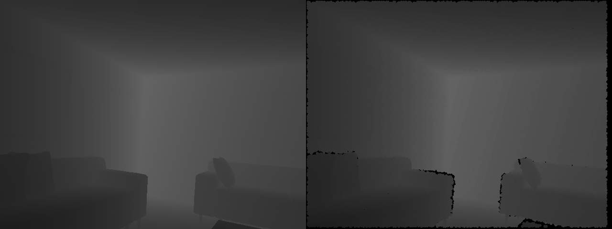

# SimKinect

Simulating Kinect Noise: adding noise to clean depth-maps rendered with a graphics engine. This is a part of the ICL-NUIM dataset. The depth noise is modelled as a combination of the noise models used in Barraon et al. 2013 and Bohg et al. 2014 as referenced below.

# How to run 

`python add_noise.py` 

# Sample Results

The left image is a sample depth image from a simulator and the right image is the depth image with noise added to it. 



# Citations

If you use this code, please consider citing the following papers

```
@article{handa:etal:2014,
  title   = {A benchmark for RGB-D visual odometry, 3D reconstruction and SLAM},
  author  = {Handa, Ankur and Whelan, Thomas and McDonald, John and Davison, Andrew J},
  journal = {ICRA},
  year    = {2014},
}

@article{Barron:etal:2013A,
  author  = {Jonathan T. Barron and Jitendra Malik},
  title   = {Intrinsic Scene Properties from a Single RGB-D Image},
  journal = {CVPR},
  year    = {2013},
}

@article{Bohg:etal:2014,
  title   = {Robot arm pose estimation through pixel-wise part classification},
  author  = {Bohg, Jeannette and Romero, Javier and Herzog, Alexander and Schaal, Stefan},
  journal = {ICRA},
  year    = {2014},
}

```

